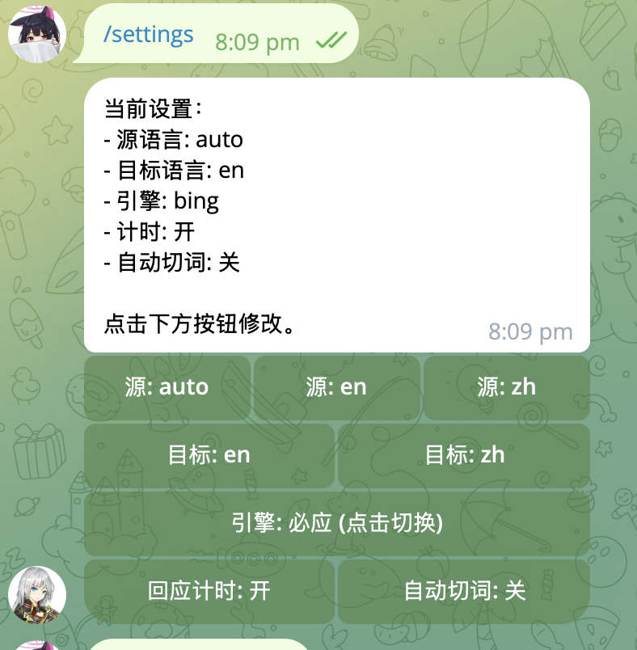
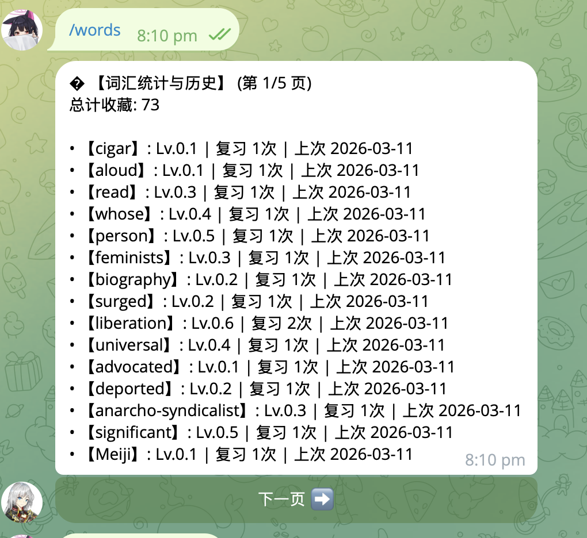
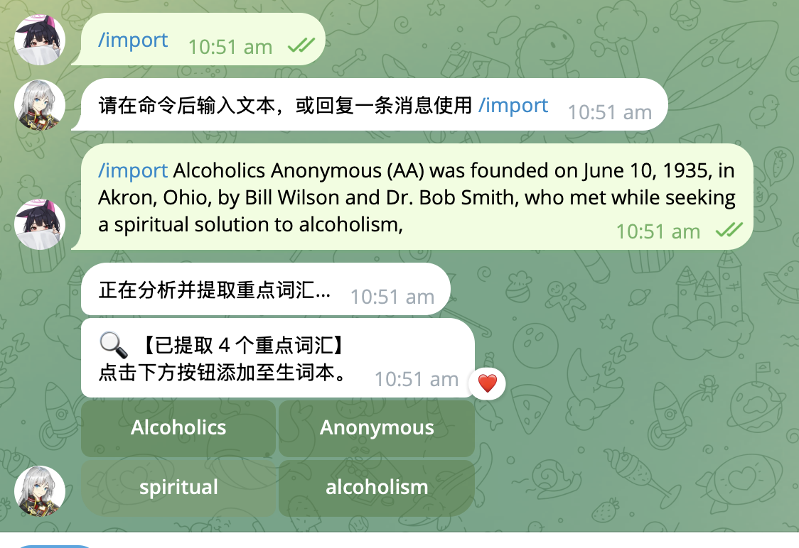
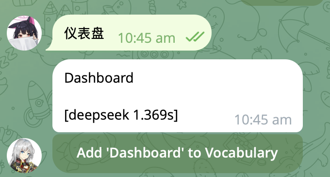

# Telegram 翻译与词汇学习机器人

[English Version](#english-version)

## 📖 项目简介

一个基于 Python Telegram Bot 的智能翻译与词汇学习助手，集成了 DeepSeek AI 引擎，提供翻译、单词学习、智能纠错、学习计划等功能。

## ✨ 核心功能

### 🤖 基础翻译
- 多引擎支持：DeepSeek、Google、Bing、百度
- 实时翻译，支持 100+ 语言互译
- 自动语言检测

### 📚 词汇学习
- **智能生词本**：翻译时一键添加生词
- **间隔复习**：基于 SM-2 算法的智能复习系统
- **学习统计**：进度追踪与可视化报告
- **7日学习计划**：AI 生成的个性化学习计划

### 🧠 AI 增强功能
- **智能纠错**：拼写错误自动纠正与候选推荐
- **单词详情**：IPA 音标、词性、例句、近反义词
- **对话查询**：`/chat` 获取单词记忆技巧与词根分析
- **难词提取**：从文本中自动提取高级词汇

### ⚙️ 个性化设置
- 可配置的翻译引擎偏好
- 自动切词开关
- 学习数量设置
- 英音/美音切换

## 🚀 快速开始

### 环境要求
- Python 3.11+
- Telegram Bot Token
- 302.AI API Key (DeepSeek)

### 安装步骤

1. **克隆项目**
```bash
git clone <your-repo-url>
cd v4
```

2. **安装依赖**
```bash
pip install -r requirements.txt
```

3. **配置环境变量**
```bash
# 复制示例配置文件
cp .env.example .env

# 编辑 .env 文件，填入您的实际密钥
# 使用文本编辑器编辑 .env 文件
```

编辑 `.env` 文件，填入以下内容：
```env
# Telegram Bot Token - 从 @BotFather 获取
BOT_TOKEN=你的Telegram机器人Token

# 302.AI API Key - 从 https://302.ai 获取
AI_API_KEY=你的302.AI API Key

# 可选配置
# DB_FILE=vocab_learning.db
# LOG_LEVEL=INFO
```

📝 **获取密钥教程**：
- **Telegram Bot Token**: 访问 [@BotFather](https://t.me/BotFather)，创建新机器人，获取 Token
- **302.AI API Key**: 注册 [302.AI](https://302.ai) 账号，在控制台获取 API Key

⚠️ **重要安全提示**: 
- 切勿将 `.env` 文件提交到 Git
- 已将 `.env` 添加到 `.gitignore` 进行保护
- 如果密钥泄露，请立即重新生成

4. **启动机器人**
```bash
python main.py
```
5. telegram
   连接机器人，通常机器人会让你输入密钥，密钥为芝麻开门
### Docker 部署
```bash
docker-compose up -d --build
```

## 📁 项目结构

```
v4/
├── handlers/           # 处理器模块
│   ├── basic_handlers.py    # 基础命令处理
│   ├── learning_handlers.py # 学习功能处理
│   └── settings_handlers.py # 设置功能处理
├── ai_service.py        # AI 服务封装
├── database.py         # 数据库操作
├── vocab_manager.py    # 词汇管理
├── logger_config.py    # 日志配置
├── main.py             # 程序入口
├── requirements.txt    # 依赖列表
└── .env               # 环境配置
```

## 🔧 配置说明

### 必需配置
- `BOT_TOKEN`: Telegram Bot Father 获取
- `AI_API_KEY`: 302.AI 平台申请

### 可选配置
- `DB_FILE`: 数据库文件路径 (默认: vocab_learning.db)
- `LOG_LEVEL`: 日志级别 (默认: INFO)

## 🎯 使用指南

### 基础命令
- `/start` - 开始使用
- `/settings` - 打开设置面板
- `/cut <文本>` - 切分句子为单词按钮
- `/import <文本>` - 提取重点词汇

### 学习命令
- `/daily [数量]` - 获取今日学习词汇
- `/review` - 开始复习
- `/words [页码]` - 查看历史单词
- `/plan` - 查看学习计划
- `/stats` - 查看学习统计
- `/detail <单词>` - 查看单词详情
- `/chat <单词>` - 单词对话查询

### 智能交互
- 直接发送文本进行翻译
- 拼写错误时自动推荐正确单词
- 翻译结果点击按钮添加生词
- 详情页面切换英音/美音
## 🖼️ 界面预览与示例

以下为部分功能的界面示例，帮助你快速了解实际使用效果（图片位于 img/ 目录）：

- 设置面板（settings）：配置翻译引擎、自动切词、每日学习数量、英/美音等偏好  
  

- 单词列表（words）：按页查看历史已添加的单词，支持进入详情或复习  
  

- 文本导入与词汇提取（import）：使用命令“/import <文本>”从段落中提取重点词汇并生成可点击按钮，便于一键加入生词本  
  

- 常见词面板（common words）：展示常见/高频词汇的快捷面板，便于快速添加学习或进行巩固复习  
  

## 🛡️ 安全注意事项

### Git 保护配置
项目已配置 `.gitignore` 保护敏感信息：
```gitignore
# 环境配置文件
.env

# 数据库文件
*.db
*.sqlite

# 日志文件
logs/
*.log

# Python 虚拟环境
.venv/
__pycache__/
*.pyc
```

### 安全最佳实践
1. **切勿提交敏感信息**：确保 `.env` 不被加入版本控制
2. **使用环境变量**：所有密钥通过环境变量配置
3. **定期更换密钥**：重要服务密钥定期更新
4. **数据库备份**：定期备份 `vocab_learning.db` 文件

## 📊 数据库设计

主要数据表：
- `users` - 用户信息与认证状态
- `vocabulary` - 词汇库
- `learning_records` - 学习记录
- `user_plan` - 学习计划
- `vocabulary_add_logs` - 词汇添加日志
- `ai_interaction_logs` - AI 交互日志

## 🔮 扩展功能

### 已实现
- [x] DeepSeek 模糊识别与纠错
- [x] IPA 音标支持（英音/美音）
- [x] 单词详情卡片
- [x] 对话式查询
- [x] 智能学习计划

### 计划中
- [ ] Cambridge 字典 API 集成
- [ ] 语音发音功能
- [ ] 多用户学习小组
- [ ] 移动端优化

## 🐛 故障排除

### 常见问题
1. **Bot 不响应**
   - 检查 `BOT_TOKEN` 是否正确
   - 确认网络连接正常

2. **翻译失败**
   - 检查 `AI_API_KEY` 是否有效
   - 确认 302.AI 服务状态

3. **数据库错误**
   - 检查数据库文件权限
   - 确认磁盘空间充足

### 获取帮助
如遇问题，请检查日志文件 `logs/bot.log` 或提交 Issue。

## 📄 许可证

本项目采用 MIT 许可证 - 详见 [LICENSE](LICENSE) 文件。

## 🤝 贡献指南

欢迎提交 Issue 和 Pull Request！

---

# English Version

# Telegram Translation & Vocabulary Learning Bot

## 📖 Project Overview

An intelligent translation and vocabulary learning assistant based on Python Telegram Bot, integrated with DeepSeek AI engine, providing translation, word learning, smart correction, and study planning features.

## ✨ Core Features

### 🤖 Basic Translation
- Multi-engine support: DeepSeek, Google, Bing, Baidu
- Real-time translation, 100+ language pairs
- Automatic language detection

### 📚 Vocabulary Learning
- **Smart Vocabulary Book**: One-click add words from translation
- **Spaced Repetition**: SM-2 algorithm based review system
- **Learning Statistics**: Progress tracking and visual reports
- **7-Day Study Plan**: AI-generated personalized learning plan

### 🧠 AI Enhanced Features
- **Smart Correction**: Automatic spelling correction and candidate suggestions
- **Word Details**: IPA phonetics, part of speech, examples, synonyms/antonyms
- **Chat Query**: `/chat` for memory techniques and root analysis
- **Difficult Word Extraction**: Automatically extract advanced vocabulary from text

### ⚙️ Personalization
- Configurable translation engine preferences
- Auto word-splitting toggle
- Learning quantity settings
- UK/US pronunciation switching

## 🚀 Quick Start

### Requirements
- Python 3.11+
- Telegram Bot Token
- 302.AI API Key (DeepSeek)

### Installation Steps

1. **Clone Project**
```bash
git clone <your-repo-url>
cd v4
```

2. **Install Dependencies**
```bash
pip install -r requirements.txt
```

3. **Configure Environment**
Create `.env` file:
```env
BOT_TOKEN=your_telegram_bot_token
AI_API_KEY=your_302_ai_api_key
```

4. **Start Bot**
```bash
python main.py
```

### Docker Deployment
```bash
docker-compose up -d --build
```

## 📁 Project Structure

```
v4/
├── handlers/           # Handler modules
│   ├── basic_handlers.py    # Basic command handling
│   ├── learning_handlers.py # Learning feature handling
│   └── settings_handlers.py # Settings handling
├── ai_service.py        # AI service wrapper
├── database.py         # Database operations
├── vocab_manager.py    # Vocabulary management
├── logger_config.py    # Logging configuration
├── main.py             # Program entry
├── requirements.txt    # Dependencies
└── .env               # Environment configuration
```

## 🔧 Configuration

### Required
- `BOT_TOKEN`: From Telegram Bot Father
- `AI_API_KEY`: From 302.AI platform

### Optional
- `DB_FILE`: Database file path (default: vocab_learning.db)
- `LOG_LEVEL`: Log level (default: INFO)

## 🎯 Usage Guide

### Basic Commands
- `/start` - Start using
- `/settings` - Open settings panel
- `/cut <text>` - Split sentence into word buttons
- `/import <text>` - Extract key vocabulary

### Learning Commands
- `/daily [count]` - Get today's learning words
- `/review` - Start review
- `/words [page]` - View history words
- `/plan` - View study plan
- `/stats` - View statistics
- `/detail <word>` - View word details
- `/chat <word>` - Word chat query

### Smart Interaction
- Send text directly for translation
- Automatic spelling correction suggestions
- Click buttons on translation results to add words
- Switch between UK/US pronunciation in detail view

## 🛡️ Security Notes

### Git Protection
Project configured with `.gitignore` to protect sensitive information:
```gitignore
# Environment config
.env

# Database files
*.db
*.sqlite

# Log files
logs/
*.log

# Python virtual environment
.venv/
__pycache__/
*.pyc
```

### Security Best Practices
1. **Never commit sensitive info**: Ensure `.env` is not in version control
2. **Use environment variables**: All keys configured via environment variables
3. **Regular key rotation**: Regularly update important service keys
4. **Database backup**: Regularly backup `vocab_learning.db` file

## 📊 Database Design

Main tables:
- `users` - User information and authentication status
- `vocabulary` - Vocabulary library
- `learning_records` - Learning records
- `user_plan` - Study plans
- `vocabulary_add_logs` - Vocabulary addition logs
- `ai_interaction_logs` - AI interaction logs

## 🔮 Extended Features

### Implemented
- [x] DeepSeek fuzzy recognition and correction
- [x] IPA phonetic support (UK/US)
- [x] Word detail cards
- [x] Conversational queries
- [x] Smart learning plans

### Planned
- [ ] Cambridge Dictionary API integration
- [ ] Voice pronunciation
- [ ] Multi-user study groups
- [ ] Mobile optimization

## 🐛 Troubleshooting

### Common Issues
1. **Bot not responding**
   - Check `BOT_TOKEN` is correct
   - Confirm network connection

2. **Translation failure**
   - Check `AI_API_KEY` is valid
   - Confirm 302.AI service status

3. **Database errors**
   - Check database file permissions
   - Confirm disk space available

### Getting Help
Check log file `logs/bot.log` or submit an Issue if problems persist.

## 📄 License

MIT License - see [LICENSE](LICENSE) file for details.

## 🤝 Contributing

Issues and Pull Requests are welcome!
