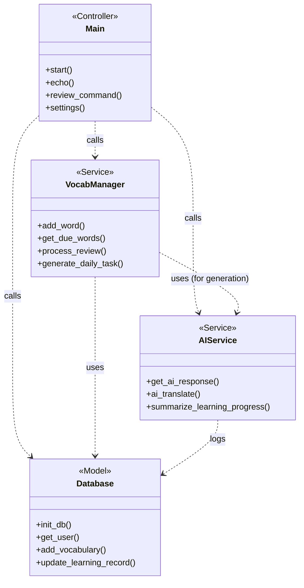
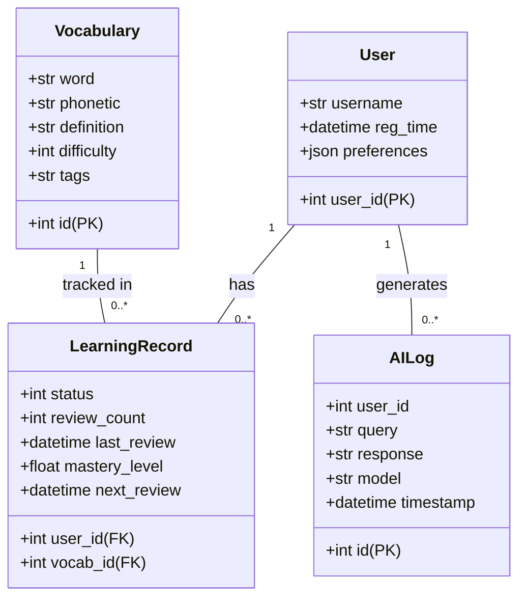

# 类图与数据模型

由于本项目采用 Python 模块化编程，以下类图主要展示**数据模型（Entity）**以及**模块（Module）**之间的依赖关系。

## 1. 模块依赖关系图 (Module Dependency)

```mermaid
classDiagram
    class Main {
        <<Controller>>
        +start()
        +echo()
        +review_command()
        +settings()
    }
    
    class AIService {
        <<Service>>
        +get_ai_response()
        +ai_translate()
        +summarize_learning_progress()
    }
    
    class VocabManager {
        <<Service>>
        +add_word()
        +get_due_words()
        +process_review()
        +generate_daily_task()
    }
    
    class Database {
        <<Model>>
        +init_db()
        +get_user()
        +add_vocabulary()
        +update_learning_record()
    }

    Main ..> AIService : calls
    Main ..> VocabManager : calls
    Main ..> Database : calls
    VocabManager ..> Database : uses
    VocabManager ..> AIService : uses (for generation)
    AIService ..> Database : logs
```

## 2. 数据库实体关系图 (ER Model)

这是基于 `database.py` 定义的 SQLite 表结构生成的类图。

```mermaid
classDiagram
    class User {
        +int user_id (PK)
        +str username
        +datetime reg_time
        +json preferences
    }

    class Vocabulary {
        +int id (PK)
        +str word
        +str phonetic
        +str definition
        +int difficulty
        +str tags
    }

    class LearningRecord {
        +int user_id (FK)
        +int vocab_id (FK)
        +int status
        +int review_count
        +datetime last_review
        +float mastery_level
        +datetime next_review
    }

    class AILog {
        +int id (PK)
        +int user_id
        +str query
        +str response
        +str model
        +datetime timestamp
    }

    User "1" -- "0..*" LearningRecord : has
    Vocabulary "1" -- "0..*" LearningRecord : tracked in
    User "1" -- "0..*" AILog : generates
```
