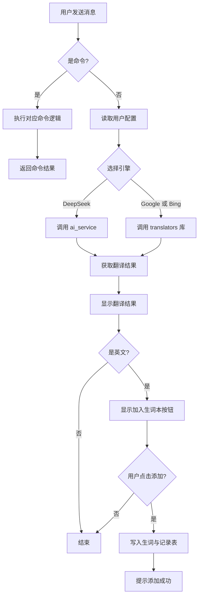
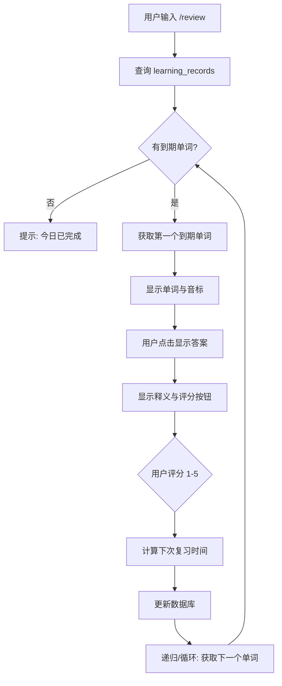

# 业务流程图

## 1. 消息处理与翻译流程

```mermaid
flowchart TD
    Start[用户发送消息] --> IsCommand{是命令?}
    
    IsCommand -- 是 --> HandleCommand[执行对应命令逻辑]
    HandleCommand --> EndCommand[返回命令结果]
    
    IsCommand -- 否 --> GetConfig[读取用户配置]
    GetConfig --> ChooseEngine{选择引擎}
    
    ChooseEngine -- DeepSeek --> CallAI[调用 ai_service]
    ChooseEngine -- Google 或 Bing --> CallLib[调用 translators 库]
    
    CallAI --> Result[获取翻译结果]
    CallLib --> Result
    
    Result --> ShowResult[显示翻译结果]
    ShowResult --> IsEnglish{是英文?}
    
    IsEnglish -- 是 --> ShowAddBtn[显示加入生词本按钮]
    IsEnglish -- 否 --> End
    
    ShowAddBtn --> ClickAdd{用户点击添加?}
    ClickAdd -- 是 --> AddToDB[写入生词与记录表]
    AddToDB --> Feedback[提示添加成功]
    ClickAdd -- 否 --> End[结束]
```

## 2. 单词复习流程

```mermaid
flowchart TD
    UserStart[用户输入 /review] --> QueryDB[查询 learning_records]
    QueryDB --> CheckDue{有到期单词?}
    
    CheckDue -- 否 --> Finish[提示: 今日已完成]
    
    CheckDue -- 是 --> FetchWord[获取第一个到期单词]
    FetchWord --> ShowFront[显示单词与音标]
    
    ShowFront --> UserClick[用户点击显示答案]
    UserClick --> ShowBack[显示释义与评分按钮]
    
    ShowBack --> Rate{用户评分 1-5}
    Rate --> CalcNext[计算下次复习时间]
    CalcNext --> UpdateDB[更新数据库]
    
    UpdateDB --> NextLoop[递归/循环: 获取下一个单词]
    NextLoop --> CheckDue
```
