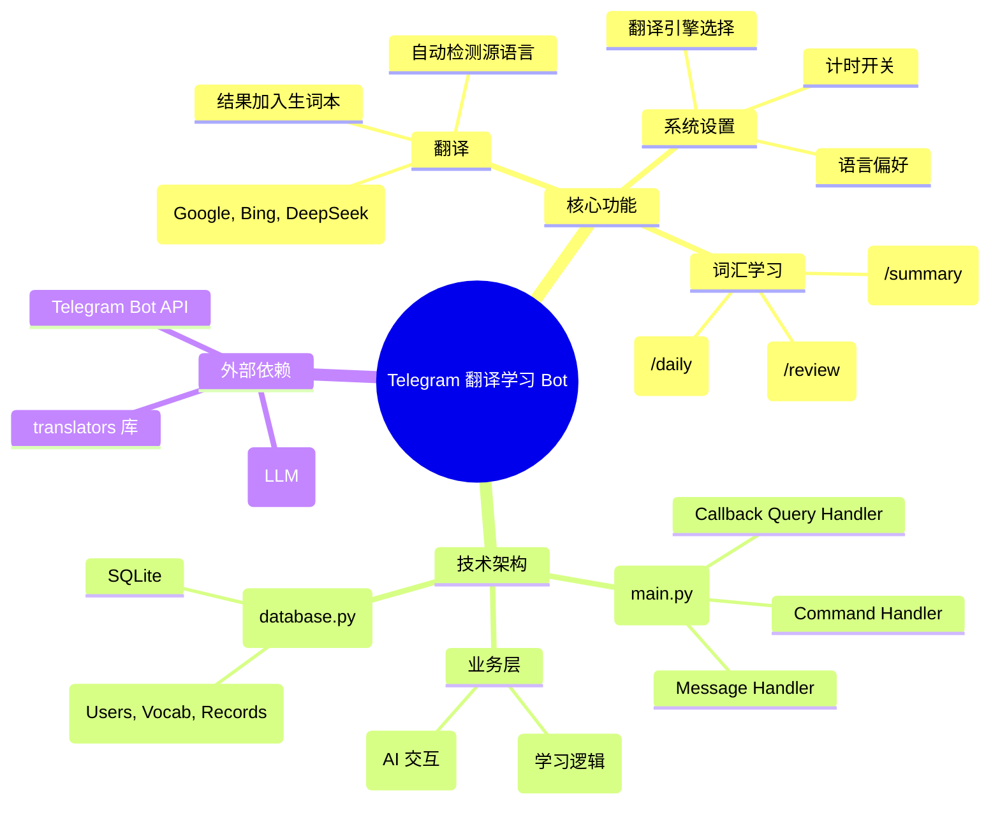

# 系统架构思维导图

```mermaid
mindmap
  root((Telegram 翻译学习 Bot))
    核心功能
      翻译
        多引擎支持 (Google, Bing, DeepSeek)
        自动检测源语言
        结果加入生词本
      词汇学习
        每日新词生成 (/daily)
        智能复习 (/review)
        学习进度总结 (/summary)
      系统设置
        语言偏好
        翻译引擎选择
        计时开关
    技术架构
      表现层 (main.py)
        Command Handler
        Message Handler
        Callback Query Handler
      业务层
        ai_service.py (AI 交互)
        vocab_manager.py (学习逻辑)
      数据层 (database.py)
        SQLite
        Schema (Users, Vocab, Records)
    外部依赖
      Telegram Bot API
      302.AI API (LLM)
      translators 库
```
